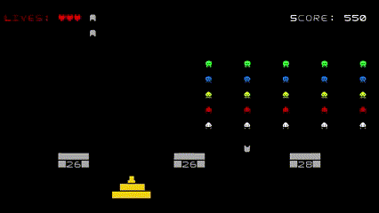
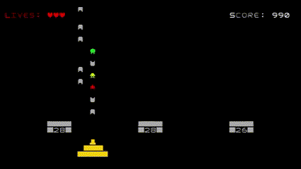

## LDTS_l01g06 - Space Invaders

Space Invaders is a fixed shooter in which the player moves a laser cannon horizontally across the bottom of the screen and fires at aliens overhead.
The aliens progressively move towards the bottom of screen.
The goal is to eliminate all the aliens by shooting them. While the player has three lives, the game ends immediately if the invaders reach the bottom of the screen.
The aliens attempt to destroy the player's cannon by firing projectiles.

This project was developed by *João Tomás Teixeira* (*up202108738*@edu.fe.up.pt), *Pedro Lima* (*up202108806*@edu.fe.up.pt) and *Pedro Januário* (*up202108768*@edu.fe.up.pt) for LDTS 2022/23.

Fig.1 - Gameplay

Fig.2 - Finishing Level 1, starting Level 2

