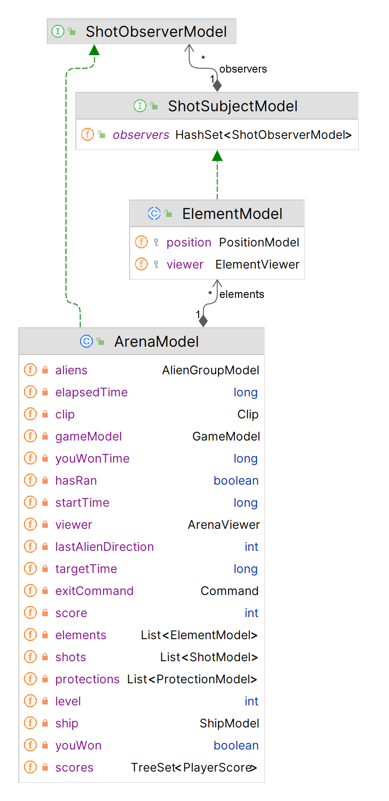
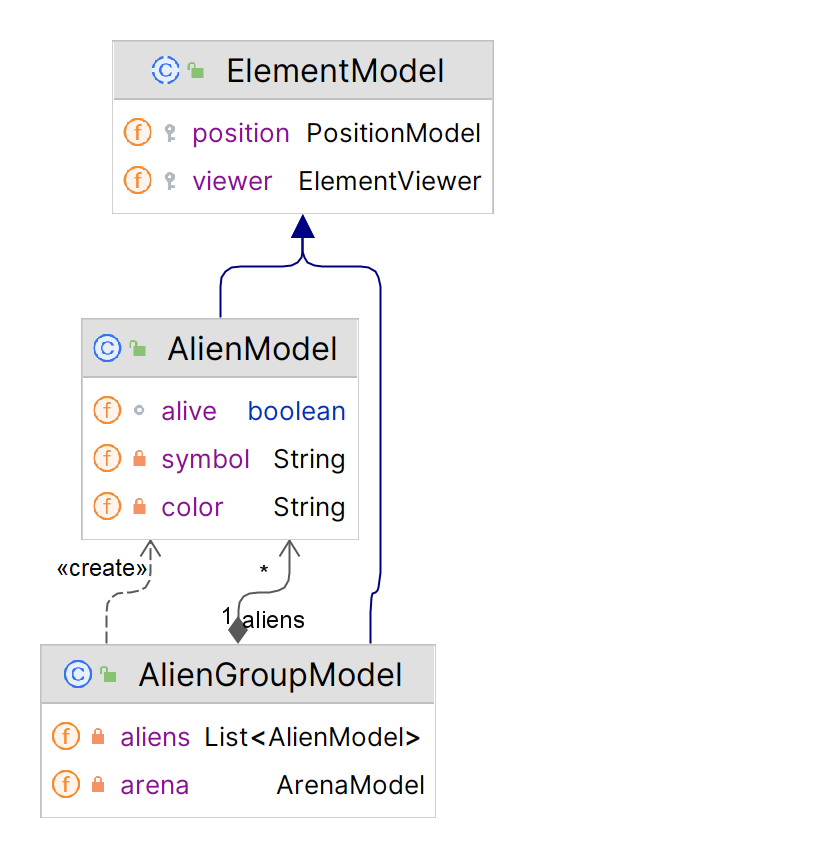
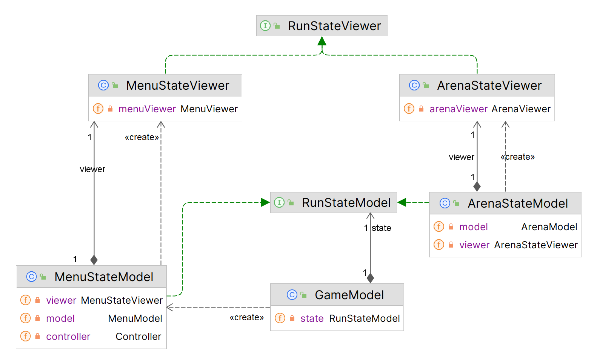
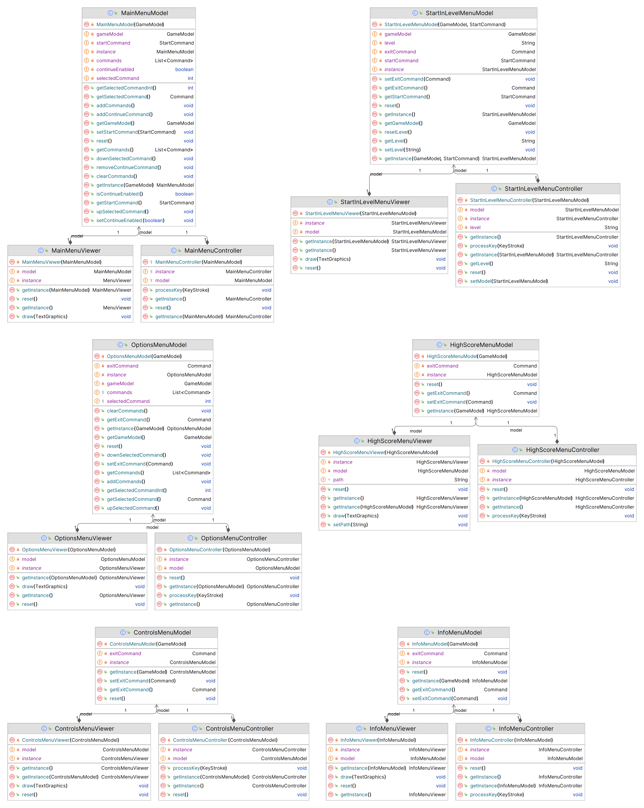
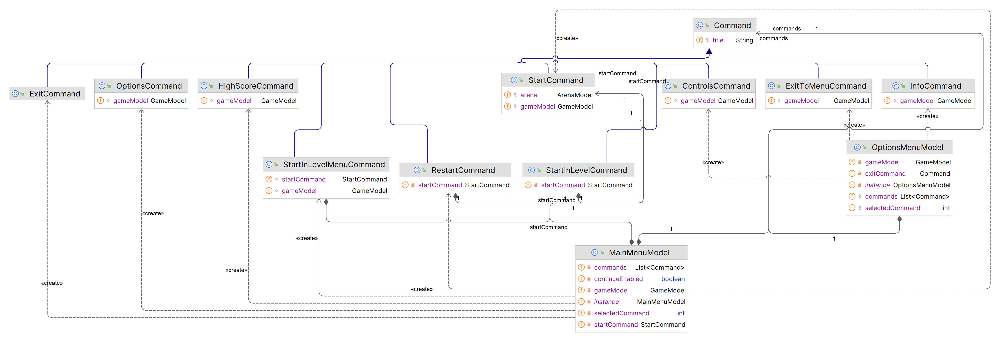
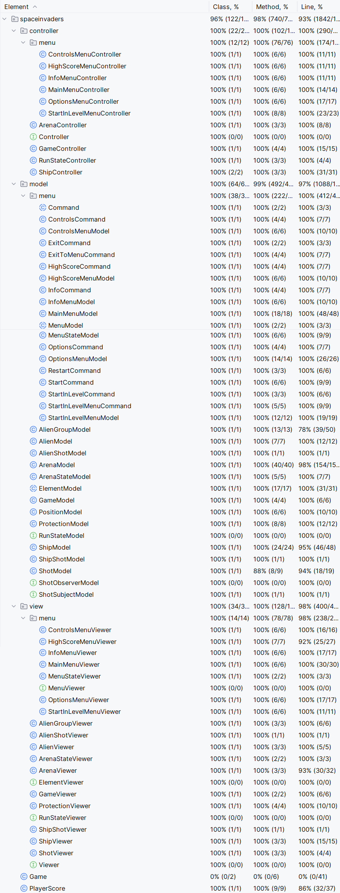
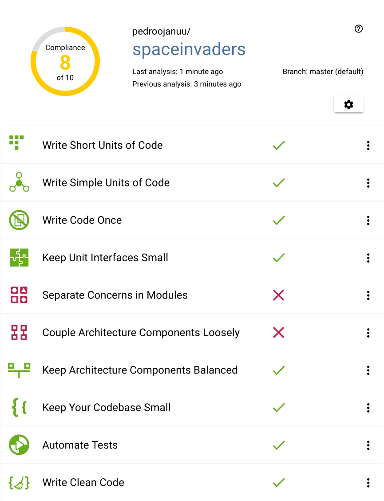

## LDTS_l01g06 - Space Invaders

Space Invaders is a fixed shooter in which the player moves a laser cannon horizontally across the bottom of the screen and fires at aliens overhead.
The aliens progressively move towards the bottom of screen.
The goal is to eliminate all the aliens by shooting them. While the player has three lives, the game ends immediately if the invaders reach the bottom of the screen.
The aliens attempt to destroy the player's cannon by firing projectiles.

This project was developed by *João Tomás Teixeira* (*up202108738*@edu.fe.up.pt), *Pedro Lima* (*up202108806*@edu.fe.up.pt) and *Pedro Januário* (*up202108768*@edu.fe.up.pt) for LDTS 2022/23.

### IMPLEMENTED FEATURES

- **Moving Ship** - The player controls a ship that moves left and right, using right/left arrow keys or A/D keys,
- **Shooting Ship** - The player can make the ship shoot a missile to kill an alien, using the up arrow or the space key. When an alien is hit, it dies and the player's score increases according to the type of the alien (killing topmost aliens gives more points than killing bottommost).
- **Moving Aliens** - The aliens move themselves in group to the left or to the right of the screen and progressively towards the bottom, where the ship is.
- **Shooting Aliens** - The aliens fire missiles directed to the bottom of the screen.
- **Protections** - There are three protections that have their own lives, which decreases when they're shot. They disappear when their lives reach 0 or aliens reach it.
- **Ship Lives** - At each level, the ship starts with three lives, represented by hearts in the top left corner of the screen.
- **Dying Ship** - The ship dies whenever its lives reach 0 or the aliens reach it.
- **Levels** - When you kill all the aliens in a level, all the aliens are respawned, the number of your lives is reset to 3 and the protections are reset too. The speed of the aliens and of their shots increases. The number of protection's lives decreases each level until a minimum of 5.
- **Sound** - A sound is played when the ship shoots and another one is played when the ship dies.
- **Main Menu** - There is a Main Menu with some options. You can travel through them using the up/down arrows, the ENTER key and the 'q' or ESC keys.
  - **(Re)Start Game** - Starts the Game in the first level.
  - **Continue Game/Restart Game** - When you pause the game by pressing the ESC key or the 'q' key, you can choose whether you want to continue the game where it was left or to restart it.
  - **Start in Level** - Starts the Game in a desired level, setting the speed of the aliens and of their shots and the protection's lives accordingly.
  - **Highscores** - Presents the top 10 scores (different of 0). A score is saved at the end of a game (when the ship dies) when it is in the top 10 and is registered along with the user's OS account name.
  - **Options**
    - **Info** - Some info about the project.
    - **Controls** - Information about the game controls.
  - **Exit** - Closes the window and terminates the program.

Fig.1 - Gameplay

Fig.2 - Finishing Level 1, starting Level 2

### DESIGN

Our implementation followed the MVC architectural pattern, represented in the UML diagram below:

<i>(For better reading, the 'zoomable' UML diagram can be found [here](../resources/images/UMLs/main.png))</i>

Fig. 3 - Main UML diagram

#### OBSERVER PATTERN
**Problem in Context** 

We needed a way to communicate to [ArenaModel](../src/main/java/spaceinvaders/model/ArenaModel.java) that an [Alien](https://github.com/FEUP-LDTS-2022/project-l01gr06/blob/8004341ab0733509fb817e9caceb1eaead67cf79/src/main/java/spaceinvaders/model/AlienModel.java#L30-L33) or the [Ship](https://github.com/FEUP-LDTS-2022/project-l01gr06/blob/8004341ab0733509fb817e9caceb1eaead67cf79/src/main/java/spaceinvaders/model/ShipModel.java#L79-L83) has fired a shot, so [ArenaViewer](../src/main/java/spaceinvaders/view/ArenaViewer.java) could draw it.

**The Pattern**

We have applied the **Observer** pattern. This pattern allows elements to notify the arena when they have fired a shot. The arena then updates the list of shots and draws them. The [ElementModel](../src/main/java/spaceinvaders/model/ElementModel.java) is the subject, so it implements the [ShotSubjectModel](../src/main/java/spaceinvaders/model/ShotSubjectModel.java) interface, and the [ArenaModel](../src/main/java/spaceinvaders/model/ArenaModel.java) is the observer, so it implements the [ShotObserverModel](../src/main/java/spaceinvaders/model/ShotObserverModel.java) interface. The ShotSubject, and subsequently the [ElementModel](../src/main/java/spaceinvaders/model/ElementModel.java), has a [list of Observers](https://github.com/FEUP-LDTS-2022/project-l01gr06/blob/70c3ae42ed8ec87b2767c2d0a6b8ab4207517a21/src/main/java/spaceinvaders/ShotSubject.java#L6) and whenever the [notifyObservers](https://github.com/FEUP-LDTS-2022/project-l01gr06/blob/8004341ab0733509fb817e9caceb1eaead67cf79/src/main/java/spaceinvaders/model/ElementModel.java#L75-L79) method is called, it notifies all the [Observers](../src/main/java/spaceinvaders/model/ShotObserverModel.java), including [ArenaModel](../src/main/java/spaceinvaders/model/ArenaModel.java) that a shot has been fired. This method is usually called inside the fire() method of [ShipModel](https://github.com/FEUP-LDTS-2022/project-l01gr06/blob/8004341ab0733509fb817e9caceb1eaead67cf79/src/main/java/spaceinvaders/model/ShipModel.java#L79-L83) and [AlienModel](https://github.com/FEUP-LDTS-2022/project-l01gr06/blob/8004341ab0733509fb817e9caceb1eaead67cf79/src/main/java/spaceinvaders/model/AlienModel.java#L30-L33).

**Implementation**

The following figure shows how the pattern’s roles were mapped to the application classes.

Fig. 4 - Observer Pattern UML

These classes can be found in the following files:
- [ShotSubjectModel](../src/main/java/spaceinvaders/model/ShotSubjectModel.java)
- [ElementModel](../src/main/java/spaceinvaders/model/ElementModel.java)
- [ShotObserverModel](../src/main/java/spaceinvaders/model/ShotObserverModel.java)
- [ArenaModel](../src/main/java/spaceinvaders/model/ArenaModel.java)

**Consequences** 

The consequence of this design is that the [ElementModel](../src/main/java/spaceinvaders/model/ElementModel.java) doesn't need to know anything about the [ArenaModel](../src/main/java/spaceinvaders/model/ArenaModel.java), and the [ArenaModel](../src/main/java/spaceinvaders/model/ArenaModel.java) doesn't need to know anything about the [ElementModel](../src/main/java/spaceinvaders/model/ElementModel.java). This design makes the code more modular and easier to understand.

#### COMPOSITE PATTERN
**Problem in Context**

We started by working with the 50 aliens directly from the [ArenaModel](../src/main/java/spaceinvaders/model/ArenaModel.java), but with time it became harder and harder to work with them.

**The Pattern**

We have applied the **Composite** pattern. This pattern allows us to control all aliens as a single object. So we joined all of them into a single element called AlienGroup  (corresponding to the classes [AlienGroupModel](../src/main/java/spaceinvaders/model/AlienGroupModel.java) and [AlienGroupViewer](../src/main/java/spaceinvaders/view/AlienGroupViewer.java)). The class [AlienGroupModel](../src/main/java/spaceinvaders/model/AlienGroupModel.java) extends the class [ElementModel](../src/main/java/spaceinvaders/model/ElementModel.java) and has a list of [Aliens](../src/main/java/spaceinvaders/model/AlienModel.java) that stores all aliens in the game, which in turn also extends the class [ElementModel](../src/main/java/spaceinvaders/model/ElementModel.java).

**Implementation**

The following figure shows how the pattern’s roles were mapped to the application classes.

Fig. 5 - Composite Pattern UML

These classes can be found in the following files:
- [ElementModel](../src/main/java/spaceinvaders/model/ElementModel.java)
- [AlienGroupModel](../src/main/java/spaceinvaders/model/AlienGroupModel.java)
- [AlienModel](../src/main/java/spaceinvaders/model/AlienModel.java)

**Consequences**

It became easier to work with the aliens, since now we only need to work with the AlienGroup, which has all the aliens. In particular, it becomes much easier to draw and add new features to aliens.

#### STATE PATTERN
**Problem in Context**

We needed to change the state of the [Game](../src/main/java/spaceinvaders/model/GameModel.java), from the [Main Menu](../src/main/java/spaceinvaders/model/menu/MainMenuModel.java) to the game itself or from the main menu to the [other menus](../src/main/java/spaceinvaders/model/menu).

**The Pattern**

We have applied the **State** pattern. This pattern allows you to represent different [GameModel](../src/main/java/spaceinvaders/model/GameModel.java) states with different subclasses. The class [GameModel](../src/main/java/spaceinvaders/model/GameModel.java) has a variable [state](https://github.com/FEUP-LDTS-2022/project-l01gr06/blob/c0690bfd418efcde9a68d979afc54693e1da76a5/src/main/java/spaceinvaders/model/GameModel.java#L14) of type [RunStateModel](../src/main/java/spaceinvaders/model/RunStateModel.java), which holds the current [state](https://github.com/FEUP-LDTS-2022/project-l01gr06/blob/c0690bfd418efcde9a68d979afc54693e1da76a5/src/main/java/spaceinvaders/model/GameModel.java#L14) of the Game. We've also implemented a [MenuStateModel](../src/main/java/spaceinvaders/model/menu/MenuStateModel.java) and an [ArenaStateModel](../src/main/java/spaceinvaders/model/ArenaStateModel.java), both implement the interface [RunStateModel](../src/main/java/spaceinvaders/model/RunStateModel.java) and store a Model, a [Controller](../src/main/java/spaceinvaders/controller/Controller.java) and a [RunStateViewer](../src/main/java/spaceinvaders/view/RunStateViewer.java) (respectively [MenuStateViewer](../src/main/java/spaceinvaders/view/menu/MenuStateViewer.java) and [ArenaStateViewer](../src/main/java/spaceinvaders/view/ArenaStateViewer.java)), which in turn was a [Viewer](../src/main/java/spaceinvaders/view/Viewer.java). In every frame the game [runs](https://github.com/FEUP-LDTS-2022/project-l01gr06/blob/c0690bfd418efcde9a68d979afc54693e1da76a5/src/main/java/spaceinvaders/model/RunStateModel.java#L7), [draws](https://github.com/FEUP-LDTS-2022/project-l01gr06/blob/c0690bfd418efcde9a68d979afc54693e1da76a5/src/main/java/spaceinvaders/view/RunStateViewer.java#L6) and [processes keys](https://github.com/FEUP-LDTS-2022/project-l01gr06/blob/c0690bfd418efcde9a68d979afc54693e1da76a5/src/main/java/spaceinvaders/controller/Controller.java#L6) through the current [state](https://github.com/FEUP-LDTS-2022/project-l01gr06/blob/c0690bfd418efcde9a68d979afc54693e1da76a5/src/main/java/spaceinvaders/model/GameModel.java#L14) stored in the [GameModel](../src/main/java/spaceinvaders/model/GameModel.java).

**Implementation**

The following figure shows how the pattern’s roles were mapped to the application classes.

Fig. 6 - State Pattern UML

These classes can be found in the following files:
- [GameModel](../src/main/java/spaceinvaders/model/GameModel.java)
- [RunStateModel](../src/main/java/spaceinvaders/model/RunStateModel.java)
- [MenuStateModel](../src/main/java/spaceinvaders/model/menu/MenuStateModel.java)
- [ArenaStateModel](../src/main/java/spaceinvaders/model/ArenaStateModel.java)
- [RunStateViewer](../src/main/java/spaceinvaders/view/RunStateViewer.java)
- [MenuStateViewer](../src/main/java/spaceinvaders/view/menu/MenuStateViewer.java)
- [ArenaStateViewer](../src/main/java/spaceinvaders/view/ArenaStateViewer.java)

**Consequences** 

Every time we change the [state](https://github.com/FEUP-LDTS-2022/project-l01gr06/blob/c0690bfd418efcde9a68d979afc54693e1da76a5/src/main/java/spaceinvaders/model/GameModel.java#L14) of the game, its behavior changes completely, so it becomes much easier to have a different class to handle each state.

#### SINGLETON PATTERN
**Problem in Context** 

All classes related to menus should only be instantiated once, so we needed to make sure that only one instance of each class was created.

**The Pattern**

We have applied the **Singleton** pattern. This pattern allows us to be sure that only one instance of each class was created. In all the classes related to menus ([MainMenuModel](../src/main/java/spaceinvaders/model/menu/MainMenuModel.java), [MainMenuViewer](../src/main/java/spaceinvaders/view/menu/MainMenuViewer.java), [MainMenuController](../src/main/java/spaceinvaders/controller/menu/MainMenuController.java), [HighScoreMenuModel](../src/main/java/spaceinvaders/model/menu/HighScoreMenuModel.java), [HighScoreMenuViewer](../src/main/java/spaceinvaders/view/menu/HighScoreMenuViewer.java), [HighScoreMenuController](../src/main/java/spaceinvaders/controller/menu/HighScoreMenuController.java), [OptionsMenuModel](../src/main/java/spaceinvaders/model/menu/OptionsMenuModel.java), [OptionsMenuViewer](../src/main/java/spaceinvaders/view/menu/OptionsMenuViewer.java), [OptionsMenuController](../src/main/java/spaceinvaders/controller/menu/OptionsMenuController.java), [ControlsMenuModel](../src/main/java/spaceinvaders/model/menu/ControlsMenuModel.java), [ControlsMenuViewer](../src/main/java/spaceinvaders/view/menu/ControlsMenuViewer.java), [ControlsMenuController](../src/main/java/spaceinvaders/controller/menu/ControlsMenuController.java), [InfoMenuModel](../src/main/java/spaceinvaders/model/menu/InfoMenuModel.java), [InfoMenuViewer](../src/main/java/spaceinvaders/view/menu/InfoMenuViewer.java), [InfoMenuController](../src/main/java/spaceinvaders/controller/menu/InfoMenuController.java), 
[StartInLevelMenuModel](../src/main/java/spaceinvaders/model/menu/StartInLevelMenuModel.java), [StartInLevelMenuViewer](../src/main/java/spaceinvaders/view/menu/StartInLevelMenuViewer.java), 
[StartInLevelMenuController](../src/main/java/spaceinvaders/controller/menu/StartInLevelMenuController.java)), we've implemented the Singleton Pattern, so that only one instance of each class is created. This is done by creating a [private static field](https://github.com/FEUP-LDTS-2022/project-l01gr06/blob/f59e76f344fa1d9ee2b423b777acd42671483a9b/src/main/java/spaceinvaders/model/menu/MainMenuModel.java#L13) that stores the only instance that should be available, making the [constructor](https://github.com/FEUP-LDTS-2022/project-l01gr06/blob/f59e76f344fa1d9ee2b423b777acd42671483a9b/src/main/java/spaceinvaders/model/menu/MainMenuModel.java#L19-L27) private and creating a [static method](https://github.com/FEUP-LDTS-2022/project-l01gr06/blob/f59e76f344fa1d9ee2b423b777acd42671483a9b/src/main/java/spaceinvaders/model/menu/MainMenuModel.java#L37-L50) that returns the instance of the class, instantiating it if it doesn't exist yet. Although we have a method called reset() that resets the instance, we only use it during tests.

**Implementation**

The following figure shows how the pattern’s roles were mapped to the application classes.

Fig. 7 - Singleton Pattern UML

These classes can be found in the following files:
- [MainMenuModel](../src/main/java/spaceinvaders/model/menu/MainMenuModel.java)
- [MainMenuViewer](../src/main/java/spaceinvaders/view/menu/MainMenuViewer.java)
- [MainMenuController](../src/main/java/spaceinvaders/controller/menu/MainMenuController.java)
- [HighScoreMenuModel](../src/main/java/spaceinvaders/model/menu/HighScoreMenuModel.java)
- [HighScoreMenuViewer](../src/main/java/spaceinvaders/view/menu/HighScoreMenuViewer.java)
- [HighScoreMenuController](../src/main/java/spaceinvaders/controller/menu/HighScoreMenuController.java)
- [OptionsMenuModel](../src/main/java/spaceinvaders/model/menu/OptionsMenuModel.java)
- [OptionsMenuViewer](../src/main/java/spaceinvaders/view/menu/OptionsMenuViewer.java)
- [OptionsMenuController](../src/main/java/spaceinvaders/controller/menu/OptionsMenuController.java)
- [ControlsMenuModel](../src/main/java/spaceinvaders/model/menu/ControlsMenuModel.java)
- [ControlsMenuViewer](../src/main/java/spaceinvaders/view/menu/ControlsMenuViewer.java)
- [ControlsMenuController](../src/main/java/spaceinvaders/controller/menu/ControlsMenuController.java)
- [InfoMenuModel](../src/main/java/spaceinvaders/model/menu/InfoMenuModel.java)
- [InfoMenuViewer](../src/main/java/spaceinvaders/view/menu/InfoMenuViewer.java)
- [InfoMenuController](../src/main/java/spaceinvaders/controller/menu/InfoMenuController.java)
- [StartInLevelMenuModel](../src/main/java/spaceinvaders/model/menu/StartInLevelMenuModel.java)
- [StartInLevelMenuViewer](../src/main/java/spaceinvaders/view/menu/StartInLevelMenuViewer.java)
- [StartInLevelMenuController](../src/main/java/spaceinvaders/controller/menu/StartInLevelMenuController.java)

**Consequences**

By using the Singleton pattern, we can be sure that only one instance of each class is created, which is important for the menus, as they should only be instantiated once.

#### COMMAND PATTERN
**Problem in Context**

We needed to have a way to execute actions when a button is pressed, this is of a particular importance for certain menus, as they have a lot of buttons that need to execute different actions.

**The Pattern**

We have applied the **Command** pattern. This pattern allows us to isolate the actions that need to be executed from the menus where they are being executed. This is done by creating several commands that extend the [Command abstract class](../src/main/java/spaceinvaders/model/menu/Command.java), which has a method called [execute()](https://github.com/FEUP-LDTS-2022/project-l01gr06/blob/f59e76f344fa1d9ee2b423b777acd42671483a9b/src/main/java/spaceinvaders/model/menu/Command.java#L5). This method is called when the button is pressed, and it executes the action that the command represents. The commands are then passed to the buttons (usually stored in a [list](https://github.com/FEUP-LDTS-2022/project-l01gr06/blob/8004341ab0733509fb817e9caceb1eaead67cf79/src/main/java/spaceinvaders/model/menu/MainMenuModel.java#L12) of [Commands](../src/main/java/spaceinvaders/model/menu/Command.java)), which execute them when the key ENTER is presses. This way, we can have different buttons that execute different actions, without having to create a new button for each action.

**Implementation**

The following figure shows how the pattern’s roles were mapped to the application classes.

Fig. 8 - Command Pattern UML

These classes can be found in the following files:
- [Command](../src/main/java/spaceinvaders/model/menu/Command.java)
- [MainMenuModel](../src/main/java/spaceinvaders/model/menu/MainMenuModel.java)
- [OptionsMenuModel](../src/main/java/spaceinvaders/model/menu/OptionsMenuModel.java)
- [StartCommand](../src/main/java/spaceinvaders/model/menu/StartCommand.java)
- [RestartCommand](../src/main/java/spaceinvaders/model/menu/RestartCommand.java)
- [StartInLevelCommand](../src/main/java/spaceinvaders/model/menu/StartInLevelCommand.java)
- [StartInLevelMenuCommand](../src/main/java/spaceinvaders/model/menu/StartInLevelMenuCommand.java)
- [HighScoreCommand](../src/main/java/spaceinvaders/model/menu/HighScoreCommand.java)
- [OptionsCommand](../src/main/java/spaceinvaders/model/menu/OptionsCommand.java)
- [ControlsCommand](../src/main/java/spaceinvaders/model/menu/ControlsCommand.java)
- [InfoCommand](../src/main/java/spaceinvaders/model/menu/InfoCommand.java)
- [ExitCommand](../src/main/java/spaceinvaders/model/menu/ExitCommand.java)
- [ExitToMenuCommand](../src/main/java/spaceinvaders/model/menu/ExitToMenuCommand.java)

**Consequences**

By using the Command pattern, we can have different buttons that execute different actions, without having to create a new button for each action. This also makes it much easier to add new actions to the menus, as we only need to create a new command and add it to the commands list.

#### DONE REFACTORINGS
#### LARGE CLASS
In the intermediary delivery we hadn't implemented MVC, so we had classes that did more than did the work of three (Model, Controller and Viewer).
So we extracted a class viewer and a class controller from each class, by extracting to these classes the methods that did this job, then renamed the original class to class model.
The class `Ship`, `Arena` and `Game` generated a Model, a Viewer and a Controller.
The class `Element`, `Alien`, `AlienShot`, `ShipShot`, `Shot` and `Protection` only generated a Model and a Viewer.
The rest didn't need to be refactored.

#### DUPLICATE CODE
In the class `ShipModel` we had methods that did the same thing, but with different names, so we removed one of them and changed all the references of the deleted one.
The methods `decreaseLives` and `damage` did the same thing, so we removed the method `decreaseLives`.
The method `died` and `isAlive` did almost the same thing, with one returning the logical opposite of the other, 
so we removed the method `died` and changed all the calls to that method to `!isAlive()`.

#### PULL UP METHOD
In the subclasses of `ElementModel` we had methods common to almost all of them, so we pulled up the methods to the superclass `ElementModel`.
These methods were `fire()`, `canIMove()`, `move()` and `collideWith()`.
Some subclasses still implement overrides of those methods due to their own particularities. 

#### DEAD CODE
We had various methods and classes that were no longer used, so we deleted them.
The classes `DummyCommad`, `NullController` and `LifeModel` were only used so the code could compile without errors, so when we finished the game we deleted them.
The method `getScore` in the class `AlienGroupModel` was also deleted.

### KNOWN CODE SMELLS AND REFACTORING SUGGESTIONS
#### REFUSED BEQUEST
Due to being subclasses of `ElementModel`, the `ProtectionModel` and `ShotModel` classes inherit `fire()` and `canIMove()` methods. However, they do not use them.
The same also happens with `damage()` in `ShotModel` and `AlienGroupModel`.

This could be solved by having an abstract subclass of `ElementModel` to represent elements that can fire, another one to represent elements that can be damaged
and a third one to represent elements that can do both.

#### FEATURE ENVY
Due to the use of the MVC architectural pattern, the `Viewer` and `Controller` classes access their respective `Model`'s data a lot, since their function
is to, respectively, represent and change the model's data and the `Model` is the one that contains the 'real world' data.

### TESTING
#### TEST COVERAGE REPORT

We could not test the Game class since any test to this class starts the whole game and goes through a `while(true)`, making it much complex to test.

Fig. 9 - Test Coverage Report

#### PITEST REPORT
[Here](../build/reports/pitest/202212231529) you can find our pitest report.

### BETTER CODE HUB ANALYSIS

<i>Note: The name of the repository in the analysis appears as `pedroojanuu/spaceinvaders`
because Better Code Hub cannot have access to the original repository, 
since none of us is its owner. We cloned it into `pedroojanuu/spaceinvaders`
(you can check it, since it's a public repository) to run the analysis. 
Because of that, a `.bettercodehub.yml` file will not be found in the
delivered repository.</i>

As it can be seen, our code does not comply with the 'Separate Concerns in 
Modules' nor with the 'Couple Architecture Components Loosely'. This is due to
the fact that we implemented an MVC architecture: the Model classes are very promiscuous since all data to be represented
/manipulated are centered in Model, e.g.: everytime we draw an element, we need to access its Model in order to retrieve
the data necessary to do so. 
Elements do not have a 'main' class that contains a Model, a Viewer and a Controller, 
instead an instance of a Viewer and of a Controller are stored in each Model, making it the 'center' of the element it 
represents.

Fig. 10 - Better Code Hub Score

### SELF-EVALUATION

- João Tomás Teixeira: 33.3%
- Pedro Lima: 33.4%
- Pedro Januário: 33.3%
